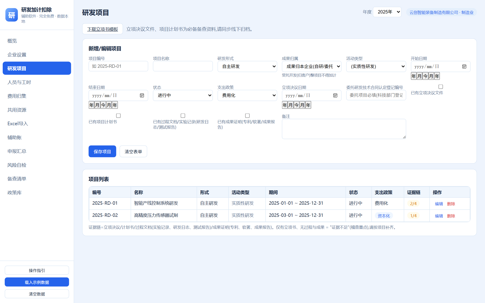
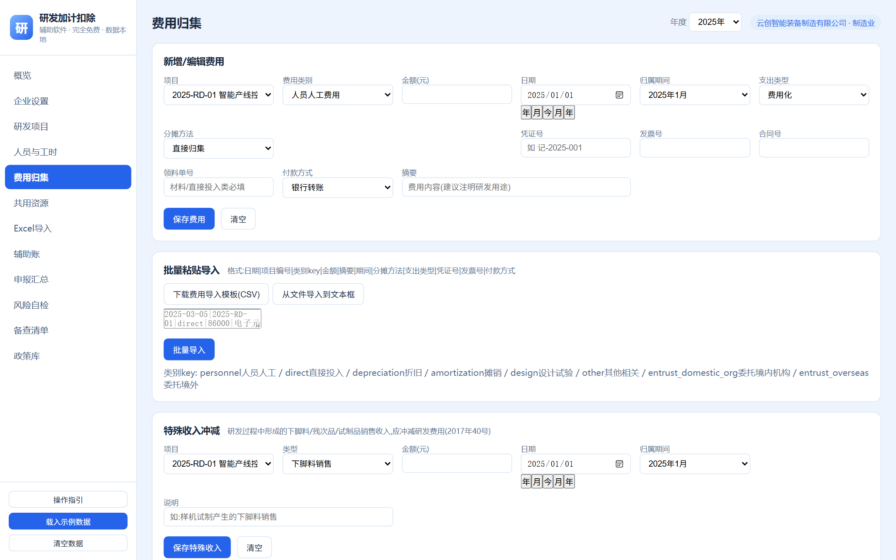
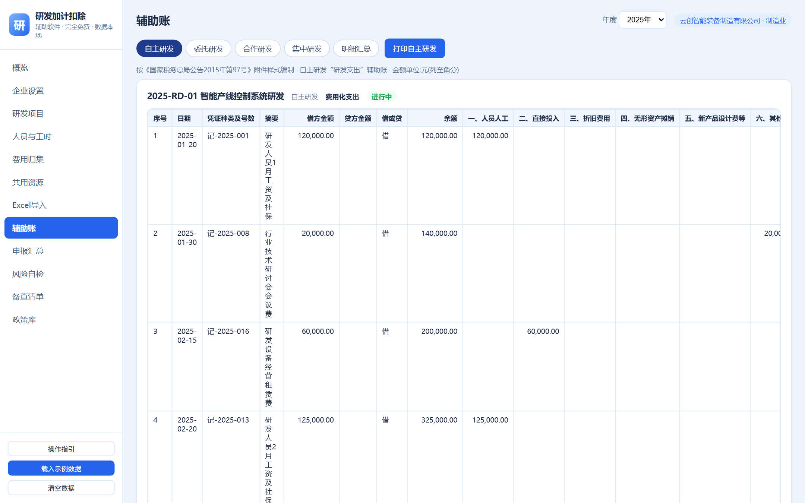
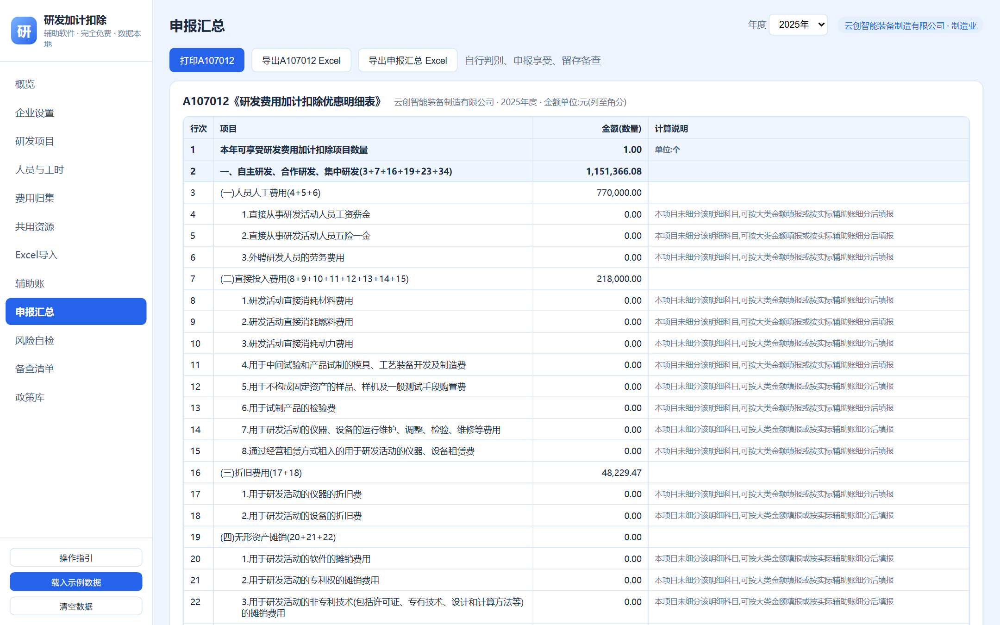
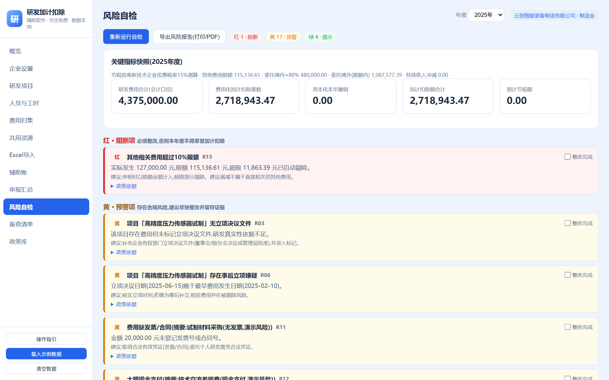
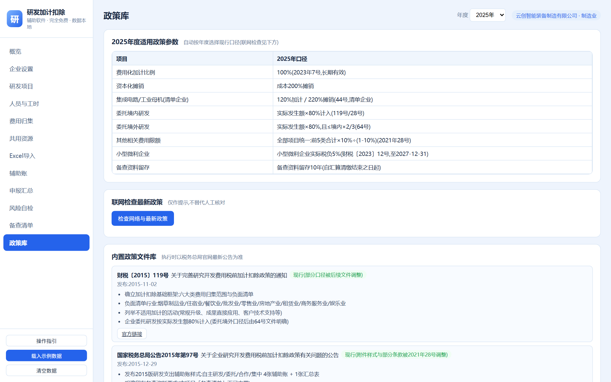

# 研发费用加计扣除辅助软件

完全免费 · 单机本地 · 数据不出电脑

面向中小企业研发费用加计扣除的辅助工具:从立项登记、工时与费用归集,到辅助账、申报汇总、风险自检、备查资料打包,全流程本地完成。依据现行政策口径计算,帮助财务人员把账做规范、把备查材料留全。

## 界面预览

概览页:年度数据总览、节税测算、风险提醒,附操作引导(完成基础配置后逐项打勾)。

研发项目页:登记立项信息(形式、决议文件、资本化/费用化),支持导出立项书模板。

费用归集页:按六大类归集研发费用,共用资源可按工时/权重分摊到项目,支持 Excel 批量导入与数电票 XML 解析。

辅助账:2021 版研发支出辅助账(97 号公告样式)样式,借方贷方与研发费用分类并列展示,支持导出 Excel。

申报汇总:A107012《研发费用加计扣除优惠明细表》行次自动汇总,分费用化、资本化口径,支持导出 Excel。

风险自检:内置核查规则逐项体检,提示立项决议缺失、事后立项、发票凭证不全、大额现金支付等风险点,支持导出风险报告。

政策库:内置常用政策条款与适用说明,供申报时对照查阅。

## 功能

- 企业设置:基础信息、征收方式、行业属性,负面清单行业预警
- 研发项目:立项登记(自主研发/委托/合作/集中),立项决议与计划书标记,项目状态管理
- 人员与工时:人员台账、逐月工时登记(支持矩阵式粘贴),工时占比自动计算
- 费用归集:人员人工、直接投入、折旧、无形资产摊销、新产品设计费、其他相关费用;共用资源(设备/房屋)按项目工时或权重分摊;自动拦截培训、招待、商业保险等不可加计支出
- 数据导入导出:Excel(xlsx/csv)批量导入,每个环节提供带填写说明的模板文件;辅助账、申报表、备查资料一键导出
- 数电票支持:XML/OFD 发票文件批量解析,自动生成费用记录
- 申报辅助:2021 版研发支出辅助账、A107012 申报汇总表行次自动计算;年度节税测算(含预缴口径)
- 风险自检:立项决议、人员工时、发票凭证、现金支付等核查规则逐项体检,附处理建议
- 备查资料:按国家税务总局备查清单自动整理五件套,一键打包归档

## 政策口径

- 加计扣除比例 100%,资本化按 200% 摊销(财政部 税务总局公告 2023 年第 7 号,长期实施)
- 委托研发:境内按 80% 计入;境外按 80% 且不超过境内符合条件的 2/3(财税〔2018〕64 号)
- 其他相关费用限额按全部项目合并计算,不超过可加计研发费用总额的 10%(国家税务总局公告 2017 年第 40 号)
- 亏损结转年限:一般企业 5 年,高新技术企业和科技型中小企业 10 年
- 辅助账样式与备查资料清单按国家税务总局公告 2015 年第 97 号、2021 年第 28 号

## 使用流程

1. 企业设置:录入企业基本信息,确认不属于负面清单行业
2. 立项登记:在研发项目页录入项目,标注立项决议与计划书是否齐备
3. 人员与工时:录入研发人员,按月登记工时,形成研发工时台账
4. 费用归集:按六大类录入费用,共用资源费用做分摊;发票 XML 可直接拖入生成
5. 检查与归档:风险自检逐项排查,导出辅助账与申报表,按备查清单打包资料

## 运行方式

- 打包版(Windows):下载 Release 中的 exe,双击运行,浏览器自动打开 http://127.0.0.1:8765
- 源码运行:`npm install && npm start`,访问 http://127.0.0.1:8765

数据保存在本机(打包版为 exe 同目录 data 文件夹),程序不联网、不上传任何数据。卸载时删除程序与 data 文件夹即可。

## 开发

- 后端 Node.js(express),前端原生 HTML/JS/CSS,无框架,依赖见 package.json
- 计算与规则集中在 `src/`:汇总口径 `src/summary.js`、风险规则 `src/risk.js`、税负测算 `src/tax.js`、数据存储 `src/storage.js`
- Windows 单文件打包采用 Node SEA,脚本见 `scripts/build-exe.ps1`(esbuild 打包 + postject 注入)

## 说明

- 本工具依据现行税收法规编写,仅供辅助参考,不构成税务意见;具体申报口径以主管税务机关认定为准
- 政策如有调整,请以财政部、税务总局最新公告为准

## License

MIT
